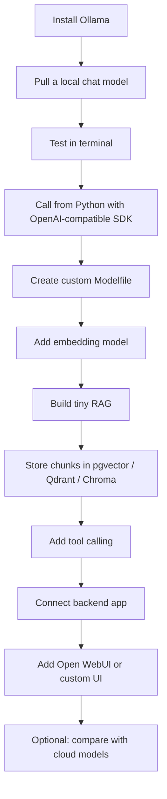

# — Mastering Ollama: Local Models, APIs, RAG, Tools, and Production Patterns

> Goal: Tutorial 01 introduced the basic local LLM stack. Tutorial 02 focuses on mastering Ollama itself: model management, APIs, Modelfiles, Hugging Face GGUF models, embeddings, RAG, tool calling, cloud models, troubleshooting, and safe integration into local or web applications.

---

## What You Should Be Able to Do After This Tutorial

By the end, you should be able to:

| Skill | What you can do |
| :--- | :--- |
| Model management | Pull, run, inspect, rename, remove, stop, and list models. |
| Local API | Call Qwen, Llama, GLM, Gemma, or other models from Python, JavaScript, Django, FastAPI, or any HTTP client. |
| OpenAI compatibility | Reuse existing OpenAI SDK code by changing only `base_url`, `api_key`, and `model`. |
| Modelfile customization | Create local assistants with system prompts, context length, temperature, stop tokens, and reusable presets. |
| Hugging Face GGUF | Run models that are not listed in Ollama's official model library. |
| RAG | Use Ollama embedding models to build a local document Q&A pipeline. |
| Tool calling | Let a model call validated Python functions, internal APIs, or read-only database tools. |
| Performance tuning | Understand context length, quantization, memory pressure, `ollama ps`, and model unloading. |
| Cloud vs local | Know when a command uses local hardware and when a `:cloud` model consumes cloud usage. |
| Application integration | Build an Ollama-powered backend for general web apps, internal tools, research assistants, or document Q&A systems. |

---

## Mental Model: What Ollama Actually Is

Ollama is not “the model.” It is a **local model runtime and management layer**.

Think of the stack like this:

```text
Your app / Terminal / Open WebUI / AnythingLLM / Django / FastAPI
        ↓
Ollama API server: http://localhost:11434
        ↓
Ollama model manager: pull, run, create, rm, ps
        ↓
Inference engine + model weights
        ↓
Your hardware: Apple Silicon / NVIDIA GPU / AMD GPU / CPU
```

**What this means:** your model does not automatically browse the web, read files, call APIs, or run code. Ollama provides the local model engine. RAG, web search, function calling, and UI features are added around it by your application or by tools such as Open WebUI and AnythingLLM.

### Ollama vs Llama vs llama.cpp vs GGUF

| Term | Meaning |
| :--- | :--- |
| **Ollama** | Local runtime, model manager, CLI, and API server. |
| **Llama** | Meta's model family, similar to how Qwen, GLM, Gemma, and Mistral are model families. |
| **llama.cpp** | Lower-level C/C++ inference engine used across many local LLM tools. |
| **GGUF** | Binary model file format optimized for local inference. |
| **Modelfile** | Ollama's recipe file for creating customized local models. |

A useful analogy:

```text
GGUF file        = model engine block
llama.cpp        = raw engine system
Ollama           = car with dashboard, ignition, model storage, and API controls
Open WebUI       = ChatGPT-like cockpit
Your application = custom product built around the model engine
```

---

## Installation and First Checks

### Install Ollama

::::{tab-set}
:::{tab-item} macOS
Download Ollama from:

https://ollama.com/download

Then drag it into `/Applications` and open it once.

Verify installation:

```bash
ollama --version
```

**Example description:** this command checks whether the Ollama CLI is available in your terminal. If macOS says `command not found`, reopen the terminal or restart Ollama so the CLI link can be created.
:::

:::{tab-item} Linux
```bash
curl -fsSL https://ollama.com/install.sh | sh
ollama --version
```

**Example description:** the first command downloads and runs Ollama's Linux installer. The second command confirms that installation succeeded and that the `ollama` executable is available in your shell.
:::

:::{tab-item} Windows
Download the installer from:

https://ollama.com/download

Then open PowerShell:

```powershell
ollama --version
```

**Example description:** PowerShell should print the installed Ollama version. If it does not, close and reopen PowerShell or reinstall Ollama.
:::

::::
### Verify the API server

Ollama normally starts its local server automatically. The default local API endpoint is:

```text
http://localhost:11434
```

Use the command for your operating system.

::::{tab-set}
:::{tab-item} macOS / Linux
```bash
curl http://localhost:11434/api/tags
```

**Example description:** this asks the local Ollama server for the list of installed models. If you receive JSON, the API server is working. This is the fastest health check before debugging Python, JavaScript, Open WebUI, or AnythingLLM connections.
:::

:::{tab-item} Windows PowerShell
```powershell
Invoke-RestMethod http://localhost:11434/api/tags
```

**Example description:** `Invoke-RestMethod` is PowerShell's native HTTP client. It converts the JSON response into PowerShell objects, which makes it easier to inspect model names on Windows.
:::

:::{tab-item} Windows CMD
```cmd
curl.exe http://localhost:11434/api/tags
```

**Example description:** Windows also has `curl.exe`. In CMD, use `curl.exe` explicitly so Windows does not confuse it with PowerShell aliases.
:::

::::
If the health check fails, start or restart Ollama manually.

::::{tab-set}
:::{tab-item} macOS
```bash
open -a Ollama
# or, if you want to run the server directly in this terminal:
ollama serve
```

**Example description:** opening the app starts Ollama in the menu bar. `ollama serve` starts the API server in the foreground, which is useful when you want to see server logs while debugging.
:::

:::{tab-item} Linux
```bash
sudo systemctl status ollama
sudo systemctl restart ollama
```

**Example description:** on most Linux installs, Ollama runs as a systemd service. `status` checks whether the service is running; `restart` reloads it after configuration or environment changes.
:::

:::{tab-item} Windows PowerShell
```powershell
ollama serve
```

**Example description:** running `ollama serve` in PowerShell starts the local API server in the foreground. Keep that window open while testing from another terminal or application.
:::

::::
### Cross-platform command convention

Most Ollama commands are identical across macOS, Linux, and Windows:

```bash
ollama list
ollama run qwen3.6
ollama ps
ollama stop qwen3.6
```

The main differences are the **shell syntax** around HTTP calls, environment variables, virtual environments, file paths, and service management.

| Task | macOS / Linux | Windows PowerShell |
| :--- | :--- | :--- |
| HTTP request | `curl ...` | `Invoke-RestMethod ...` or `curl.exe ...` |
| Environment variable | `export NAME=value` | `$env:NAME="value"` |
| Python launcher | `python3` | `py` or `python` |
| Activate venv | `source .venv/bin/activate` | `.\.venv\Scripts\Activate.ps1` |
| Home directory | `~/Models` | `$HOME\Models` |

**Example description:** the model commands are portable, but the surrounding operating-system commands are not always portable. When copying examples, match the shell you are using.

### Where Ollama stores models

Model storage locations are useful when you need to estimate disk usage, back up models, or move a model cache to a larger drive.

| OS | Common location |
| :--- | :--- |
| macOS | `~/.ollama/models` |
| Linux user install | `~/.ollama/models` |
| Linux service install | often `/usr/share/ollama/.ollama/models` |
| Windows | `%USERPROFILE%\.ollama\models` |

::::{tab-set}
:::{tab-item} macOS / Linux
```bash
du -sh ~/.ollama/models 2>/dev/null
```

**Example description:** this estimates how much disk space your local Ollama models consume. Large models and multiple quantizations can quickly use hundreds of gigabytes.
:::

:::{tab-item} Windows PowerShell
```powershell
Get-ChildItem "$env:USERPROFILE\.ollama\models" -Recurse | Measure-Object -Property Length -Sum
```

**Example description:** this recursively sums model files in the Windows Ollama model directory. The result is shown in bytes, which you can divide by `1GB` for a rough gigabyte estimate.
:::

::::
---

## Core CLI Commands You Must Know

### Download a model

```bash
ollama pull qwen3.6
ollama pull llama3.2
ollama pull embeddinggemma
```

**Example description:** `pull` downloads model weights into Ollama's local model store. `qwen3.6` and `llama3.2` are chat/generation models, while `embeddinggemma` is an embedding model used for semantic search and RAG.

### Run a model interactively

```bash
ollama run qwen3.6
```

**Example description:** `run` loads the model and opens an interactive terminal chat. If the model is not already downloaded, Ollama usually pulls it first.

Exit the interactive session:

```text
/bye
```

**Example description:** `/bye` exits the terminal chat without deleting the model. The model may stay loaded briefly for faster reuse.

### List downloaded models

```bash
ollama list
# or
ollama ls
```

**Example description:** this shows local model names, IDs, sizes, and modified dates. Use the exact model name from this output when calling Ollama from code.

### Show model information

```bash
ollama show qwen3.6
ollama show --modelfile qwen3.6
```

**Example description:** `ollama show` displays metadata such as architecture, parameter size, quantization, context information, and template details. `--modelfile` shows how Ollama packages the model internally.

### List running models

```bash
ollama ps
```

**Example description:** this is one of the most useful diagnostic commands. It shows currently loaded models, memory size, processor placement, context allocation, and how long the model will remain loaded.

### Stop a running model

```bash
ollama stop qwen3.6
```

**Example description:** this unloads a model from memory. Use it when your machine feels slow, when a different model needs memory, or before changing large context settings.

### Remove a model

```bash
ollama rm llama3.2
```

**Example description:** this deletes a local model from disk. It is useful because model files can easily consume tens or hundreds of gigabytes.

### Copy or rename a model

```bash
ollama cp qwen3.6 qwen-local
ollama run qwen-local
```

**Example description:** `cp` creates a local alias. This is useful when you want a stable model name for an application even if the underlying base model changes later.

OpenAI-style alias example:

```bash
ollama cp qwen3.6 gpt-4
```

**Example description:** some OpenAI-compatible tools expect a model name such as `gpt-4`. This alias lets those tools call `model="gpt-4"` while actually using your local Ollama model. Use aliases carefully so users are not confused about which model is really running.

---

## Model Names, Tags, and Versions

Ollama model names often follow this pattern:

```text
model:tag
```

Examples:

```text
qwen3.6
qwen3.6:35b-mlx
llama3.2
deepseek-r1:7b
glm-5.2:cloud
hf.co/bartowski/Llama-3.2-3B-Instruct-GGUF:Q4_K_M
```

**Example description:** the part before `:` is the model family or repository. The part after `:` is the variant, such as size, quantization, MLX build, or cloud mode. If you omit the tag, Ollama often uses `latest`.

### Local vs cloud

```bash
ollama run qwen3.6
```

**Example description:** this usually runs locally. It uses your machine's CPU/GPU/unified memory and does not consume Ollama Cloud usage.

```bash
ollama run glm-5.2:cloud
```

**Example description:** the `:cloud` suffix means the model runs through Ollama Cloud. It may consume cloud usage, credits, or plan limits. Use it for tasks that are too large for local hardware, not for routine private or offline work.

### Hugging Face models

For GGUF models on Hugging Face:

```bash
ollama run hf.co/<username>/<repo>:<quantization>
```

**Example description:** `hf.co/...` tells Ollama to load a GGUF model from Hugging Face instead of the official Ollama library. `<quantization>` selects the compressed version, such as `Q4_K_M` or `Q5_K_M`.

Concrete example:

```bash
ollama run hf.co/bartowski/Llama-3.2-3B-Instruct-GGUF:Q4_K_M
```

**Example description:** this runs a specific Hugging Face GGUF model with a Q4 quantization. It is useful when Ollama's official library does not yet list a new or specialized model.

---

## Quantization: Q4, Q5, Q8, IQ2, MLX

Quantization compresses model weights to reduce memory and disk usage. Lower precision usually means lower memory cost, but sometimes lower output quality.

| Quant | Rough meaning | Good for |
| :--- | :--- | :--- |
| `Q8_0` | High quality, large memory | Smaller models when quality matters |
| `Q6_K` | Very good quality | Medium models on strong hardware |
| `Q5_K_M` | Balanced quality | Daily use when memory allows |
| `Q4_K_M` | Popular default | Most local use |
| `IQ3_M` | Smaller, lower quality | Large models |
| `IQ2_M` | Very compressed | Huge models or quick testing |
| `IQ1_M` | Extreme compression | Only when necessary |
| `mlx` | Apple Silicon optimized variant | Mac M-series machines when available |

General rule:

```text
Small models: Q5 or Q6 if possible
Medium models: Q4 or Q5
Huge models: IQ2 or IQ3 may be necessary
Apple Silicon: try MLX variants when available
```

**Example description:** quantization choice is a trade-off. If a model fails to load, choose a smaller model or lower quantization. If output quality is poor and memory is available, choose a higher-quality quantization.

---

## Interactive Chat: Useful Terminal Techniques

### One-shot prompt

```bash
ollama run qwen3.6 "Explain SQL joins in simple terms."
```

**Example description:** this sends one prompt and prints one answer without keeping you in a long interactive workflow. It is useful for quick tests, shell scripts, and comparing model outputs.

### Multiline prompt

Inside `ollama run`:

```text
>>> """You are helping design a generic document management system.
... Propose database tables for documents, users, permissions, and audit logs.
... """
```

**Example description:** triple quotes make it easier to send longer instructions. The key operation is giving the model enough structured context without needing an external file.

### Image input with a vision model

Only works with vision-capable models.

```bash
ollama run gemma4 "Describe this image: ./sample-image.jpg"
```

**Example description:** this sends an image path to a vision-capable model. Use it for image description, visual QA, and report writing. Do not assume every text model can read images.

---

## REST API: The Most Important Interface

Ollama's local API usually runs here:

```text
http://localhost:11434
```

### `/api/generate`

Good for simple prompt completion.

```bash
curl http://localhost:11434/api/generate \
  -H "Content-Type: application/json" \
  -d '{
    "model": "qwen3.6",
    "prompt": "Explain RAG in 5 bullet points.",
    "stream": false
  }'
```

**Example description:** `/api/generate` is the simplest endpoint. `model` selects the local model, `prompt` contains the user instruction, and `stream:false` asks Ollama to return one complete JSON response instead of many small streaming chunks.

### `/api/chat`

Better for multi-turn chat-style messages.

```bash
curl http://localhost:11434/api/chat \
  -H "Content-Type: application/json" \
  -d '{
    "model": "qwen3.6",
    "messages": [
      {"role": "system", "content": "You are a careful technical tutor."},
      {"role": "user", "content": "Explain the difference between SQL and NoSQL."}
    ],
    "stream": false
  }'
```

**Example description:** `/api/chat` separates messages by role. The `system` message controls behavior, while the `user` message contains the task. This format is better for apps because it preserves conversation structure.

### Streaming vs non-streaming

For easier development:

```json
"stream": false
```

**Example description:** non-streaming is simpler because your code receives one complete JSON object. It is best for scripts, tests, and backend jobs.

For ChatGPT-like UI:

```json
"stream": true
```

**Example description:** streaming returns partial tokens as the model generates them. It makes the UI feel faster but requires your frontend or backend to handle a stream of chunks.

### Windows PowerShell API examples

The REST API is the same on every operating system, but Windows users often prefer PowerShell objects instead of raw JSON strings.

```powershell
$body = @{
  model = "qwen3.6"
  messages = @(
    @{ role = "user"; content = "Explain what Ollama does in two sentences." }
  )
  stream = $false
} | ConvertTo-Json -Depth 5

$response = Invoke-RestMethod `
  -Uri "http://localhost:11434/api/chat" `
  -Method Post `
  -ContentType "application/json" `
  -Body $body

$response.message.content
```

**Example description:** this is the PowerShell equivalent of the `/api/chat` cURL example. `ConvertTo-Json -Depth 5` is important because chat messages are nested objects; without enough depth, PowerShell can truncate nested JSON.

If you prefer the OpenAI-compatible endpoint:

```powershell
$body = @{
  model = "qwen3.6"
  messages = @(
    @{ role = "system"; content = "You are a concise assistant." },
    @{ role = "user"; content = "Give me a one-line definition of RAG." }
  )
} | ConvertTo-Json -Depth 5

$response = Invoke-RestMethod `
  -Uri "http://localhost:11434/v1/chat/completions" `
  -Method Post `
  -ContentType "application/json" `
  -Body $body

$response.choices[0].message.content
```

**Example description:** this uses Ollama's OpenAI-compatible path. It is useful when your application already follows the OpenAI chat completion response structure.

---

## Python: Native Ollama SDK

Install:

```bash
pip install ollama
```

**Example description:** this installs the official Python client, which wraps Ollama's local HTTP API so you do not need to write raw `requests` calls.

### Basic chat

```python
from ollama import chat

response = chat(
    model="qwen3.6",
    messages=[
        {"role": "system", "content": "You are a helpful local AI assistant."},
        {"role": "user", "content": "Explain what GGUF is."},
    ],
)

print(response.message.content)
```

**Example description:** `chat()` sends structured role-based messages to the local model. The important part is `model="qwen3.6"`: it must match a model shown by `ollama list`.

### Streaming

```python
from ollama import chat

stream = chat(
    model="qwen3.6",
    messages=[{"role": "user", "content": "Write a short intro to Ollama."}],
    stream=True,
)

for chunk in stream:
    print(chunk.message.content, end="", flush=True)
```

**Example description:** `stream=True` returns tokens gradually. The loop prints each partial chunk immediately, which is how many chat interfaces create the real-time typing effect.

---

## Python: OpenAI-Compatible SDK

This is the most useful method if your existing code already uses the OpenAI SDK.

Install:

```bash
pip install openai
```

**Example description:** the OpenAI SDK can talk to Ollama because Ollama exposes an OpenAI-compatible `/v1` API. This makes provider switching much easier.

### Minimal example

```python
from openai import OpenAI

client = OpenAI(
    base_url="http://localhost:11434/v1",
    api_key="ollama",  # any non-empty string works for local Ollama
)

response = client.chat.completions.create(
    model="qwen3.6",
    messages=[
        {"role": "system", "content": "You are a professional coding assistant."},
        {"role": "user", "content": "Write a Python function that validates an email address."},
    ],
)

print(response.choices[0].message.content)
```

**Example description:** `base_url` redirects the OpenAI SDK to your local Ollama server. `api_key` is required by the SDK, but Ollama does not require a real cloud API key for local use. `model` must be an installed Ollama model name.

### Why this matters

You can switch providers by changing only these values:

```python
base_url = "http://localhost:11434/v1"
api_key = "ollama"
model = "qwen3.6"
```

**Example description:** this pattern prevents vendor lock-in. The same application can use local Ollama during development and a cloud or server-hosted model later by changing environment variables.

---

## JavaScript / Node.js

Install:

```bash
npm install openai
```

**Example description:** this installs the official OpenAI JavaScript SDK. Like the Python SDK, it can call Ollama through the OpenAI-compatible endpoint.

Example:

```javascript
import OpenAI from "openai";

const client = new OpenAI({
  baseURL: "http://localhost:11434/v1",
  apiKey: "ollama",
});

const completion = await client.chat.completions.create({
  model: "qwen3.6",
  messages: [
    { role: "system", content: "You are a careful software architect." },
    { role: "user", content: "Design a REST API for a document approval workflow." },
  ],
});

console.log(completion.choices[0].message.content);
```

**Example description:** this is the Node.js equivalent of the Python OpenAI-compatible example. It is useful for Express, Next.js, Electron apps, and browser-facing backends that need to call a local or internal model server.

---

## Modelfile: Create Your Own Local Assistant

A `Modelfile` is a recipe for creating a customized Ollama model. It can define a base model, system prompt, context length, sampling parameters, and other behavior.

### Basic generic assistant

Create a file named `Modelfile`:

```dockerfile
FROM qwen3.6

SYSTEM """
You are a local AI assistant for technical work.
Give concise, accurate, practical answers.
When information is missing, ask for the missing input or state the uncertainty clearly.
Do not invent facts, file contents, IDs, dates, or external source details.
"""

PARAMETER temperature 0.3
PARAMETER num_ctx 32768
```

**Example description:** `FROM` chooses the base model. `SYSTEM` defines default behavior. `temperature 0.3` makes answers more deterministic. `num_ctx 32768` increases how much text the model can consider, but also increases memory use.

Create and run the model:

```bash
ollama create local-technical-assistant -f Modelfile
ollama run local-technical-assistant
```

**Example description:** `ollama create` builds a named model from your recipe. After that, `local-technical-assistant` behaves like any other Ollama model and can be called from CLI or API.

### Useful Modelfile instructions

| Instruction | Purpose |
| :--- | :--- |
| `FROM` | Base model name or local GGUF path. |
| `SYSTEM` | Default behavior, persona, constraints, and response policy. |
| `PARAMETER` | Runtime parameters such as temperature and context length. |
| `TEMPLATE` | Custom prompt template. Advanced use only. |
| `ADAPTER` | Apply LoRA / QLoRA adapter when supported. |
| `MESSAGE` | Seed conversation examples. |
| `LICENSE` | Add model license text. |
| `REQUIRES` | Minimum Ollama version. |

### View an existing model's Modelfile

```bash
ollama show --modelfile qwen3.6
```

**Example description:** this reveals the model's packaging details. It is useful when you want to learn how a model formats prompts or when you want to copy a template into your own custom model.

---

## Runtime Parameters You Should Understand

| Parameter | Meaning | Typical value |
| :--- | :--- | :--- |
| `temperature` | Randomness / creativity | `0.1–0.4` for code, `0.7–1.0` for writing |
| `top_p` | Nucleus sampling | `0.8–0.95` |
| `num_ctx` | Context window length | `4096`, `32768`, `65536`, `131072` |
| `num_predict` | Max generated tokens | `512–4096` |
| `stop` | Stop sequences | model-specific |
| `repeat_penalty` | Reduces repetition | `1.05–1.2` |

### Practical presets

Coding assistant:

```dockerfile
PARAMETER temperature 0.2
PARAMETER top_p 0.9
PARAMETER num_ctx 32768
```

**Example description:** low temperature reduces randomness and is useful for code, SQL, config files, and deterministic instructions.

Creative writing:

```dockerfile
PARAMETER temperature 0.8
PARAMETER top_p 0.95
PARAMETER num_ctx 32768
```

**Example description:** higher temperature allows more variety. Use it for brainstorming, writing, naming, and creative drafts.

Strict RAG assistant:

```dockerfile
PARAMETER temperature 0.1
PARAMETER top_p 0.8
PARAMETER num_ctx 65536
```

**Example description:** strict RAG should be conservative. Low randomness helps the model stay close to retrieved documents, while larger context leaves room for retrieved chunks.

---

## Context Length and Memory

Context length is how much text the model can “see” at once.

More context helps with:

```text
long documents
large code files
RAG chunks
web search results
agent tool outputs
multi-turn conversations
```

But larger context uses more memory.

### Check actual context allocation

```bash
ollama ps
```

**Example description:** look at the `CONTEXT` column. A model may support a large maximum context, but Ollama may allocate a smaller context unless configured.

### Increase context globally when serving

```bash
OLLAMA_CONTEXT_LENGTH=64000 ollama serve
```

**Example description:** this starts the Ollama server with a larger default context length. It is useful for experiments but can increase memory pressure for every loaded model.

### Increase context through Modelfile

```dockerfile
FROM qwen3.6
PARAMETER num_ctx 65536
```

**Example description:** setting `num_ctx` in a Modelfile creates a reusable model preset with a larger context window.

Then build and run:

```bash
ollama create qwen-large-context -f Modelfile
ollama run qwen-large-context
```

**Example description:** this keeps the larger-context behavior attached to the custom model name rather than requiring you to remember environment variables each time.

---

## Toy Experiment 1 — Compare System Prompts

Goal: see how a system prompt changes behavior.

### Plain model

```bash
ollama run qwen3.6 "Design a database schema for a document review system."
```

**Example description:** this uses the base model without a custom system prompt. The result will depend mostly on the model's default behavior.

### Custom model

Create `Modelfile`:

```dockerfile
FROM qwen3.6
SYSTEM """
You are a senior backend architect.
Always produce practical tables, fields, relationships, indexes, and implementation notes.
"""
PARAMETER temperature 0.2
```

**Example description:** this custom prompt tells the model what role to take and what output structure to prefer. `temperature 0.2` makes the schema more stable and less creative.

Build and run:

```bash
ollama create backend-architect -f Modelfile
ollama run backend-architect "Design a database schema for a document review system."
```

**Example description:** now the same task goes through a customized model wrapper. Compare the outputs and note whether the custom model gives more structured database design.

**Expected lesson:** system prompts and temperature matter a lot even with the same base model.

---

## Toy Experiment 2 — Build a Tiny Local RAG System

Goal: understand RAG without a framework.

Install dependencies:

```bash
pip install ollama numpy
```

**Example description:** `ollama` provides access to local chat and embedding APIs. `numpy` is used to compute cosine similarity between vectors.

Pull an embedding model:

```bash
ollama pull embeddinggemma
# or
ollama pull qwen3-embedding
```

**Example description:** embedding models convert text into vectors. You need them for semantic search because normal chat models do not automatically index documents.

Create `tiny_rag.py`:

```python
import numpy as np
import ollama

DOCS = [
    "A knowledge base stores short text chunks from uploaded documents.",
    "Embeddings convert text into vectors that can be compared by similarity.",
    "RAG retrieves relevant chunks before asking the language model to answer.",
    "A strict RAG assistant should say when the provided context is insufficient.",
]

def embed(text: str):
    result = ollama.embed(model="embeddinggemma", input=text)
    return np.array(result["embeddings"][0], dtype=np.float32)

doc_vecs = [embed(d) for d in DOCS]

def cosine(a, b):
    return float(np.dot(a, b) / (np.linalg.norm(a) * np.linalg.norm(b)))

question = "Why does RAG need embeddings?"
q_vec = embed(question)

scores = [(cosine(q_vec, v), doc) for v, doc in zip(doc_vecs, DOCS)]
scores.sort(reverse=True, key=lambda x: x[0])

context = "\n".join(doc for _, doc in scores[:2])

response = ollama.chat(
    model="qwen3.6",
    messages=[
        {
            "role": "system",
            "content": "Answer strictly based on the provided context. If the context is insufficient, say so.",
        },
        {
            "role": "user",
            "content": f"Context:\n{context}\n\nQuestion:\n{question}",
        },
    ],
)

print(response["message"]["content"])
```

**Example description:** this toy script demonstrates the entire RAG loop in miniature. `DOCS` are your fake knowledge base, `embed()` vectorizes text, cosine similarity retrieves relevant chunks, and the retrieved context is inserted into the model prompt.

Run:

```bash
python tiny_rag.py
```

**Example description:** the final answer should be grounded in the two most relevant chunks. If you change the question, different chunks should be retrieved.

**Expected lesson:** RAG is not magic. It is retrieve → insert context → ask model.

---

## RAG Architecture for Real Projects

For a serious local RAG stack:

| Layer | Recommended options |
| :--- | :--- |
| File parsing | Docling, Marker, PyMuPDF, Unstructured, Apache Tika |
| Chunking | LangChain, LlamaIndex, custom splitter |
| Embedding | `embeddinggemma`, `qwen3-embedding`, `nomic-embed-text`, `bge-m3` |
| Vector DB | PostgreSQL + pgvector, Qdrant, Chroma, FAISS |
| LLM | Qwen, Llama, Gemma, Mistral, GLM local/cloud |
| App backend | Django, FastAPI, Flask, Express |
| UI | Open WebUI, AnythingLLM, custom React/Vue/Svelte UI |

### RAG database design example

For PostgreSQL + pgvector:

```text
Document
- id
- title
- source_type
- file_path
- uploaded_by
- created_at

DocumentChunk
- id
- document_id
- chunk_index
- text
- page_number
- token_count
- embedding vector
- metadata jsonb

ChatSession
- id
- user_id
- created_at

ChatMessage
- id
- session_id
- role
- content
- retrieved_chunk_ids
- created_at
```

**Example description:** `Document` stores file-level metadata. `DocumentChunk` stores searchable pieces of the document and their embeddings. `ChatMessage` can store which chunks were retrieved so answers can be audited later.

---

## Toy Experiment 3 — Tool Calling

Goal: let the model call a Python function.

Install:

```bash
pip install ollama
```

**Example description:** this installs the Ollama Python SDK, which supports chat requests with tool definitions.

Create `tool_calling_demo.py`:

```python
import json
import ollama


def estimate_ticket_priority(severity: int, affected_users: int, business_impact: int) -> dict:
    """
    Estimate support ticket priority.
    severity: 1-5
    affected_users: 1-5
    business_impact: 1-5
    """
    score = severity * 0.45 + affected_users * 0.25 + business_impact * 0.30
    if score >= 4:
        level = "High"
    elif score >= 2.5:
        level = "Medium"
    else:
        level = "Low"
    return {"score": round(score, 2), "priority": level}


tools = [
    {
        "type": "function",
        "function": {
            "name": "estimate_ticket_priority",
            "description": "Estimate priority for a support ticket.",
            "parameters": {
                "type": "object",
                "properties": {
                    "severity": {"type": "integer", "description": "Issue severity from 1 to 5"},
                    "affected_users": {"type": "integer", "description": "Number/importance of affected users from 1 to 5"},
                    "business_impact": {"type": "integer", "description": "Business impact from 1 to 5"},
                },
                "required": ["severity", "affected_users", "business_impact"],
            },
        },
    }
]

messages = [
    {
        "role": "user",
        "content": "A login outage has severity 5, affected users 4, and business impact 5. Estimate its priority.",
    }
]

first = ollama.chat(
    model="qwen3.6",
    messages=messages,
    tools=tools,
)

messages.append(first["message"])

if first["message"].get("tool_calls"):
    for call in first["message"]["tool_calls"]:
        name = call["function"]["name"]
        args = call["function"]["arguments"]

        if name == "estimate_ticket_priority":
            result = estimate_ticket_priority(**args)
            messages.append({
                "role": "tool",
                "content": json.dumps(result),
            })

second = ollama.chat(
    model="qwen3.6",
    messages=messages,
)

print(second["message"]["content"])
```

**Example description:** the model does not execute Python directly. It sees the tool schema, decides whether to call the tool, and returns a tool call request. Your code validates the function name and arguments, runs the Python function, appends the tool result, and asks the model to produce the final answer.

Run:

```bash
python tool_calling_demo.py
```

**Example description:** the final response should explain the priority using the numeric result from your function. This pattern is the foundation for safe agents.

**Expected lesson:** the model proposes tool calls; your application executes only approved tools.

---

## Tool Calling Pattern for Web Applications

A real agent loop looks like this:

```text
User asks a question
        ↓
LLM decides whether it needs a tool
        ↓
Backend validates the tool call
        ↓
Backend executes a safe function / API / DB query
        ↓
Tool result is appended to messages
        ↓
LLM writes the final answer
```

Useful generic tools:

| Tool | What it does |
| :--- | :--- |
| `search_documents(query)` | Search a RAG knowledge base. |
| `query_records(filters)` | Query internal records with validated filters. |
| `get_summary(record_id)` | Summarize a selected record. |
| `create_draft(payload)` | Create a draft object for human review. |
| `run_sql_readonly(sql)` | Run only approved read-only analytics queries. |
| `web_search(query)` | Search current public web information. |
| `read_uploaded_file(file_id)` | Parse a user-uploaded file. |

Security rule:

```text
Never let the model execute arbitrary SQL, shell commands, file writes, or external API calls directly.
The model proposes; your backend validates.
```

**Example description:** tools should be narrow, typed, and permission-checked. A model should never receive unrestricted access to production systems.

---

## Embeddings: What They Are and How Ollama Uses Them

Embeddings turn text into numeric vectors.

They are used for:

```text
semantic search
duplicate detection
document clustering
RAG
recommendation
similarity search
```

### Generate embeddings with cURL

```bash
curl -X POST http://localhost:11434/api/embed \
  -H "Content-Type: application/json" \
  -d '{
    "model": "embeddinggemma",
    "input": "A user reports that login fails after entering a correct password."
  }'
```

**Example description:** `/api/embed` returns a vector instead of a natural-language answer. You store this vector in a vector database and compare it to other vectors for semantic search.

### Generate embeddings in Python

```python
import ollama

result = ollama.embed(
    model="embeddinggemma",
    input="A user reports that login fails after entering a correct password."
)

vector = result["embeddings"][0]
print(len(vector))
```

**Example description:** the printed length is the embedding dimension. Every vector in the same index must have the same dimension and come from the same embedding model.

### Important embedding rule

Do not mix embedding models in the same vector index.

```text
Index documents with embeddinggemma → query with embeddinggemma
Index documents with qwen3-embedding → query with qwen3-embedding
```

**Example description:** different embedding models produce vectors in different spaces. Mixing them makes similarity search unreliable, even if the vectors look like normal arrays.

---

## Structured Outputs / JSON Mode

For app development, you often do not want prose. You want JSON.

### JSON output with `/api/chat`

```bash
curl http://localhost:11434/api/chat \
  -H "Content-Type: application/json" \
  -d '{
    "model": "qwen3.6",
    "messages": [
      {
        "role": "user",
        "content": "Return JSON for a support ticket with fields: title, severity, priority, reason."
      }
    ],
    "format": "json",
    "stream": false
  }'
```

**Example description:** `format:"json"` asks Ollama to constrain the output to JSON. This is useful for classification, extraction, database previews, and backend workflows.

### Practical use

Structured output is useful for:

```text
classification
entity extraction
feature attributes
inspection summaries
database insert previews
workflow routing
```

Example target shape:

```json
{
  "ticket_id": "TICKET-00123",
  "issue_type": "login_failure",
  "severity": 4,
  "priority": "high",
  "recommended_action": "investigate authentication service"
}
```

**Example description:** the model can generate this JSON, but your backend must validate required fields, allowed enum values, data types, and permissions before storing or acting on it.

---

## Vision Models

Some Ollama models can accept images.

Example CLI:

```bash
ollama run gemma4 "What is visible in this image? ./sample-image.jpg"
```

**Example description:** this uses a vision-capable model to inspect an image. The text model and vision model may be different; always confirm the model supports images before relying on image input.

Example API pattern:

```json
{
  "model": "vision-model-name",
  "messages": [
    {
      "role": "user",
      "content": "Describe the important objects in this image.",
      "images": ["BASE64_IMAGE_STRING"]
    }
  ]
}
```

**Example description:** API calls usually send images as base64 strings. This is better for web apps where the image comes from an upload rather than a local file path.

Recommended pattern:

```text
Specialized computer vision model = precise detection or segmentation
Vision LLM = explanation, report writing, visual QA, human-readable summary
```

**Example description:** vision LLMs are strong at descriptions and reasoning, but they are not always a substitute for specialized detection models when exact measurements or high recall are required.

---

## Hugging Face GGUF Workflow

Ollama's official library will not always have the newest models. Hugging Face often has GGUF versions earlier.

### Direct run from Hugging Face

```bash
ollama run hf.co/<username>/<repo>
```

**Example description:** this points Ollama to a Hugging Face repository. It works best when the repository contains a compatible GGUF file and a simple layout.

With quantization tag:

```bash
ollama run hf.co/<username>/<repo>:Q4_K_M
```

**Example description:** the tag after `:` selects a quantization. If the tag does not exist, check the repository's file list and use the exact available quantization or filename.

Concrete example:

```bash
ollama run hf.co/bartowski/Llama-3.2-3B-Instruct-GGUF:Q4_K_M
```

**Example description:** this runs a Hugging Face GGUF model that may not be present in the official Ollama library. It is a useful pattern for trying newer community quantizations.

### Full filename as tag

Sometimes this works:

```bash
ollama run hf.co/<username>/<repo>:model-name-Q4_K_M.gguf
```

**Example description:** some repositories expose multiple `.gguf` filenames instead of simple tags. Using the full filename can disambiguate which file Ollama should download.

### Manual GGUF import

Download a `.gguf` file, then create a `Modelfile`:

```dockerfile
FROM ./model.Q4_K_M.gguf
```

**Example description:** this tells Ollama to build a local model from a GGUF file already on your machine. It is useful when direct Hugging Face pulling fails or when you want to manage files yourself.

Create model:

```bash
ollama create my-gguf-model -f Modelfile
ollama run my-gguf-model
```

**Example description:** after import, `my-gguf-model` becomes a normal Ollama model name. Your Python, JavaScript, and API calls can use it like any other model.

### Sharded GGUF warning

If files look like this:

```text
model-00001-of-00008.gguf
model-00002-of-00008.gguf
...
```

that is a sharded GGUF model.

**Example description:** sharding means one model is split across multiple GGUF files. Some Ollama workflows may not support direct pulling of sharded GGUF repositories, depending on version and layout.

Possible solutions:

```text
1. use llama.cpp directly
2. merge shards if supported
3. find a single-file GGUF
4. use a different quantization
5. wait for improved Ollama support
```

---

## Cloud Models

Some models are too large to run locally conveniently.

Example:

```bash
ollama run glm-5.2:cloud
```

**Example description:** `:cloud` tells Ollama to use cloud execution. This is not a local deployment, and it can consume account usage or plan limits.

This is not the same as:

```bash
ollama run qwen3.6
```

**Example description:** a normal local model command loads weights on your computer. It may be slower or memory-heavy, but it does not depend on cloud model usage.

| Command | Runs where | Consumes local hardware | Consumes cloud usage |
| :--- | :--- | :--- | :--- |
| `ollama run qwen3.6` | Your machine | Yes | No |
| `ollama run qwen3.6:35b-mlx` | Apple Silicon machine | Yes | No |
| `ollama run glm-5.2:cloud` | Ollama Cloud | Minimal | Yes |
| `ollama run hf.co/...` | Usually local download/run | Yes | No, unless the model is cloud-specific |

Use cloud models for:

```text
huge long-context tasks
difficult coding tasks
occasional high-quality comparison
models too large for local memory
```

Use local models for:

```text
daily coding
RAG over private documents
offline work
bulk experimentation
sensitive data
```

---

## Web Search

Local models cannot browse the web by themselves.

You need one of these:

| Option | Notes |
| :--- | :--- |
| Ollama web search | Uses Ollama's web search capability / API key. |
| SearXNG | Self-hosted meta-search. More private. |
| Brave Search API | Simple API, external service. |
| Tavily | Good for agent workflows. |
| Custom scraper | More control, more maintenance. |

Recommended local architecture:

```text
User question
  ↓
Router: does this need current web info?
  ↓
Search API returns results
  ↓
Fetch / clean web pages
  ↓
Put snippets into context
  ↓
Local model summarizes with source links
```

**Example description:** the model is not the browser. Your application retrieves web content, cleans it, tracks URLs and timestamps, then asks the model to summarize the retrieved evidence.

For serious use, store:

```text
source URL
page title
retrieval timestamp
content snippet
hash or cache key
```

**Example description:** storing metadata makes answers auditable and helps avoid mixing old search results with fresh claims.

---

## Open WebUI and AnythingLLM

Ollama is the engine. It is not a complete ChatGPT replacement by itself.

For a ChatGPT-like local UI:

| Tool | Best for |
| :--- | :--- |
| Open WebUI | ChatGPT-like UI, model management, RAG, tools, web search, users |
| AnythingLLM | Document Q&A, workspaces, simple RAG |
| LM Studio | Desktop GUI for model testing |
| Dify | Building LLM apps with workflows |
| LlamaIndex / LangChain | Python RAG/agent frameworks |

A practical path:

```text
Step 1: Ollama + a local chat model
Step 2: Open WebUI for daily local ChatGPT-like use
Step 3: AnythingLLM for document workspaces
Step 4: Custom backend integration for your own application
```

**Example description:** this separates responsibilities. Ollama runs models, Open WebUI/AnythingLLM provide user-facing workflows, and your backend handles business rules and data permissions.

---

## Production Pattern for Django / FastAPI

### Minimal backend architecture

```text
Django/FastAPI
  ├── /api/chat
  ├── /api/rag/query
  ├── /api/documents/upload
  ├── /api/tools/query-records
  ├── /api/tools/create-draft
  └── Ollama client
          └── http://localhost:11434/v1
```

**Example description:** the application should not expose Ollama directly to every user. Your backend should validate requests, enforce permissions, manage RAG retrieval, and decide which tools are allowed.

### Generic service wrapper

```python
# services/llm.py
from openai import OpenAI
from django.conf import settings

client = OpenAI(
    base_url=getattr(settings, "OLLAMA_BASE_URL", "http://localhost:11434/v1"),
    api_key=getattr(settings, "OLLAMA_API_KEY", "ollama"),
)

def ask_local_model(messages, model="qwen3.6", temperature=0.2):
    response = client.chat.completions.create(
        model=model,
        messages=messages,
        temperature=temperature,
    )
    return response.choices[0].message.content
```

**Example description:** this wrapper hides provider details from the rest of your application. Views, tasks, or services call `ask_local_model()` instead of directly constructing API requests everywhere.

Usage:

```python
answer = ask_local_model([
    {"role": "system", "content": "You are a careful internal documentation assistant."},
    {"role": "user", "content": "Summarize this technical note in 5 bullets."},
])
```

**Example description:** application code passes a standard `messages` list. This makes it easy to add RAG context, conversation history, or tool results before calling the model.

### Recommended environment variables

```bash
OLLAMA_BASE_URL=http://localhost:11434/v1
OLLAMA_MODEL=qwen3.6
OLLAMA_EMBED_MODEL=embeddinggemma
```

**Example description:** environment variables let you change models or servers without editing source code. This is especially important when moving between local development and deployment.

---

## Performance Tuning Checklist

### If responses are slow

Check:

```bash
ollama ps
```

**Example description:** look at `PROCESSOR`, `CONTEXT`, and `SIZE`. If a model is running mostly on CPU or using an enormous context, responses can be slow.

Possible fixes:

```text
use a smaller model
use lower quantization
reduce num_ctx
close other apps
stop unused models
use MLX version on Apple Silicon if available
```

### If you run out of memory

Try:

```bash
ollama stop <model>
```

**Example description:** stopping a loaded model frees memory. Replace `<model>` with the exact model name from `ollama ps`.

Use a smaller model:

```bash
ollama run qwen3.6:27b-mlx
```

**Example description:** a smaller or optimized variant can be much more practical than the largest available model, especially for daily use.

Reduce context:

```dockerfile
PARAMETER num_ctx 8192
```

**Example description:** context length is often a hidden memory cost. Reducing it can make a model usable even when the base model size stays the same.

### If API connection fails

Test:

```bash
curl http://localhost:11434/api/tags
```

**Example description:** this isolates the problem. If this fails, the issue is Ollama server connectivity, not your Python or JavaScript code.

Start server:

```bash
ollama serve
```

**Example description:** use this when Ollama is installed but no API server is listening.

Check port:

```bash
lsof -i :11434
```

**Example description:** this shows whether another process is using Ollama's default port. Port conflicts can prevent the server from starting.

---

## Security and Privacy Rules

Local models are powerful, but your wrapper code decides safety.

### Good rules

```text
Use local models for private documents.
Use read-only tools first.
Validate all tool arguments.
Whitelist database queries.
Never expose arbitrary shell access.
Log model outputs that create actions.
Use human approval for writes.
```

**Example description:** the model can generate convincing but wrong actions. Your application must enforce boundaries and require review for anything that changes data or sends information externally.

### Bad patterns

```text
Letting the model run any SQL it writes.
Letting the model execute shell commands.
Letting the model send emails without confirmation.
Letting the model create/delete production records without review.
Trusting model JSON without validation.
```

**Example description:** these mistakes turn a helpful assistant into an unsafe automation system. Treat model output as untrusted until validated.

---

## Troubleshooting Table

| Problem | Likely cause | Fix |
| :--- | :--- | :--- |
| `command not found: ollama` | CLI not in PATH | Restart terminal; reinstall; on macOS allow Ollama to create CLI link. |
| `connection refused localhost:11434` | Ollama server not running | Open Ollama app or run `ollama serve`. |
| Model is too slow | Too large / CPU offload / huge context | Use smaller model, MLX version, smaller `num_ctx`. |
| Out of memory | Model/context too large | Stop other models, reduce context, use lower quantization. |
| `glm-5.2:cloud` uses credit | It is a cloud model | Use local models for daily work; reserve cloud for hard tasks. |
| HF model says sharded GGUF unsupported | Repo contains split GGUF files | Use llama.cpp, find single-file GGUF, or different quant. |
| RAG answers are wrong | Bad chunking / wrong embedding / weak retrieval | Improve chunking, re-index, use better embedding, cite chunks. |
| API returns streaming chunks | `stream` default | Set `"stream": false`. |
| OpenAI SDK cannot find model | Model name mismatch | Run `ollama list`; use exact model name. |
| Context too small | Default context allocation | Use `PARAMETER num_ctx` or `OLLAMA_CONTEXT_LENGTH`. |

---

## Recommended Learning Path

### Phase 1 — Basic control

```bash
ollama list
ollama pull qwen3.6
ollama run qwen3.6
ollama ps
ollama stop qwen3.6
```

**Example description:** these commands teach the model lifecycle: list what exists, download, run, inspect memory state, and stop when finished.

### Phase 2 — API coding

```text
Python native Ollama SDK
OpenAI-compatible Python SDK
Django/FastAPI wrapper
streaming response
```

**Example description:** after CLI basics, focus on programmatic access. This is what turns a local model into something your applications can use.

### Phase 3 — Customization

```text
Modelfile
system prompt
temperature
num_ctx
custom local assistant
```

**Example description:** customization lets you encode default behavior once instead of repeating long system prompts in every request.

### Phase 4 — RAG

```text
embedding model
chunking
vector DB
retrieval
citations
strict document-only answering
```

**Example description:** RAG is the main way to give a local model private, up-to-date, or domain-specific knowledge without fine-tuning.

### Phase 5 — Agent/tools

```text
tool schema
tool validation
safe execution
database read tools
human approval for writes
```

**Example description:** tools give the model controlled access to actions. Validation and approval are more important than the model's reasoning.

### Phase 6 — Advanced model sourcing

```text
Hugging Face GGUF
quantization
manual import
llama.cpp fallback
cloud model comparison
```

**Example description:** once you understand the core workflow, Hugging Face and llama.cpp let you try models beyond the official Ollama library.

---

## End-to-End Workflow for a Local AI Stack



**Example description:** this workflow shows how to grow from one local command into a full application stack. Each step adds a capability: model access, customization, private knowledge, tools, backend integration, and UI.

---

## Mini Project — Generic Local Documentation Assistant

### Goal

Build a local assistant that can:

```text
1. answer questions about uploaded documents
2. summarize long technical notes
3. classify support tickets or internal requests
4. generate draft responses for human review
5. call safe read-only backend tools
```

**Example description:** this project is intentionally generic. It teaches the same building blocks needed for many private AI assistants without depending on any specific organization or domain.

### Suggested stack

```text
LLM: qwen3.6, Llama, Gemma, Mistral, or another local model
Embedding: embeddinggemma, qwen3-embedding, nomic-embed-text, or bge-m3
Backend: Django, FastAPI, Flask, or Express
Database: PostgreSQL + pgvector, Qdrant, Chroma, or FAISS
RAG: uploaded documents, markdown notes, PDFs, internal manuals
Tools: search_documents, query_records, create_draft, summarize_file
UI: Open WebUI for testing, custom web UI later
```

**Example description:** this stack separates the chat model, embedding model, database, backend, tools, and UI. That separation makes the system easier to debug and replace piece by piece.

### Example system prompt

```text
You are a local documentation assistant.
Answer using provided documents and retrieved context.
If the evidence is missing, say what is missing instead of guessing.
Never invent document titles, record IDs, dates, or approval status.
For actions that change data, create a draft and ask for human confirmation.
```

**Example description:** this system prompt is conservative on purpose. It encourages document-grounded answers and prevents the assistant from pretending to know facts that were not retrieved.

---

## Knowledge Quiz

### Q1. What command shows downloaded local models?

<details>
<summary>Answer</summary>

```bash
ollama list
```

or:

```bash
ollama ls
```

</details>

### Q2. What command shows currently running models and context length?

<details>
<summary>Answer</summary>

```bash
ollama ps
```

</details>

### Q3. What does `glm-5.2:cloud` mean?

<details>
<summary>Answer</summary>

It means the model runs through Ollama Cloud, not fully on your local machine. It may consume Ollama Cloud usage, credits, or plan limits.

</details>

### Q4. What is the easiest way to reuse existing OpenAI SDK code with Ollama?

<details>
<summary>Answer</summary>

Set:

```python
client = OpenAI(
    base_url="http://localhost:11434/v1",
    api_key="ollama",
)
```

Then use your local model name, such as:

```python
model="qwen3.6"
```

</details>

### Q5. What is the basic RAG pipeline?

<details>
<summary>Answer</summary>

```text
documents → chunks → embeddings → vector database → retrieve relevant chunks → send context to LLM → answer with sources
```

</details>

### Q6. Why should you not mix embedding models in one vector index?

<details>
<summary>Answer</summary>

Different embedding models produce vectors in different vector spaces. If documents are embedded with one model and questions with another, similarity search becomes unreliable.

</details>

### Q7. What is a Modelfile?

<details>
<summary>Answer</summary>

A Modelfile is Ollama's recipe for creating a customized model from a base model or local model file. It can define `FROM`, `SYSTEM`, `PARAMETER`, `TEMPLATE`, `ADAPTER`, and other instructions.

</details>

---

## Appendix A — Cross-Platform Examples: macOS, Windows, and Linux

This section collects equivalent commands for the most common operations. Use it as a quick translation table when an example appears to be written for a different operating system.

### A.1 Health check and model list

::::{tab-set}
:::{tab-item} macOS / Linux
```bash
ollama list
curl http://localhost:11434/api/tags
```

**Example description:** `ollama list` checks the local model registry from the CLI. `curl /api/tags` checks the same idea through the HTTP API, which is what applications use.
:::

:::{tab-item} Windows PowerShell
```powershell
ollama list
Invoke-RestMethod http://localhost:11434/api/tags
```

**Example description:** the first command confirms the CLI works. The second confirms the local API works and returns the installed models as PowerShell objects.
:::

:::{tab-item} Windows CMD
```cmd
ollama list
curl.exe http://localhost:11434/api/tags
```

**Example description:** CMD can use `curl.exe` for the API health check. This is useful on machines where PowerShell execution policies are restricted.
:::

::::
### A.2 Run the same model on each OS

::::{tab-set}
:::{tab-item} macOS / Linux
```bash
ollama run qwen3.6
```

**Example description:** this loads the model and starts an interactive terminal chat. If the model is missing, Ollama downloads it first.
:::

:::{tab-item} Windows PowerShell / CMD
```powershell
ollama run qwen3.6
```

**Example description:** Ollama's model commands are the same on Windows. The difference usually appears only when you write JSON, paths, or environment variables.
:::

::::
### A.3 Python virtual environment setup

::::{tab-set}
:::{tab-item} macOS / Linux
```bash
python3 -m venv .venv
source .venv/bin/activate
python3 -m pip install -U ollama openai numpy
```

**Example description:** this creates an isolated Python environment, activates it, and installs the Ollama SDK, OpenAI SDK, and NumPy for simple RAG experiments.
:::

:::{tab-item} Windows PowerShell
```powershell
py -m venv .venv
.\.venv\Scripts\Activate.ps1
py -m pip install -U ollama openai numpy
```

**Example description:** Windows virtual environments use a different activation script. If activation is blocked, run PowerShell as the current user and set a less restrictive execution policy for the session.
:::

:::{tab-item} Windows CMD
```cmd
py -m venv .venv
.venv\Scripts\activate.bat
py -m pip install -U ollama openai numpy
```

**Example description:** CMD uses `activate.bat` instead of the PowerShell activation script.
:::

::::
### A.4 Run toy scripts

::::{tab-set}
:::{tab-item} macOS / Linux
```bash
python3 tiny_rag.py
python3 tool_calling_demo.py
```

**Example description:** these commands run the tutorial's toy RAG and tool-calling scripts with the active Python environment.
:::

:::{tab-item} Windows PowerShell / CMD
```powershell
py tiny_rag.py
py tool_calling_demo.py
```

**Example description:** `py` is the Windows Python launcher. It helps select the installed Python version consistently.
:::

::::
### A.5 Environment variables

::::{tab-set}
:::{tab-item} macOS / Linux temporary session
```bash
export OLLAMA_HOST=127.0.0.1:11434
export OLLAMA_KEEP_ALIVE=5m
export OLLAMA_CONTEXT_LENGTH=8192
ollama serve
```

**Example description:** these variables affect the Ollama server launched from the same shell. They are temporary and disappear when the terminal closes.
:::

:::{tab-item} Windows PowerShell temporary session
```powershell
$env:OLLAMA_HOST="127.0.0.1:11434"
$env:OLLAMA_KEEP_ALIVE="5m"
$env:OLLAMA_CONTEXT_LENGTH="8192"
ollama serve
```

**Example description:** `$env:` sets variables for the current PowerShell session. Start `ollama serve` from that same window so the server receives the settings.
:::

:::{tab-item} Linux systemd service
```bash
sudo systemctl edit ollama
```

Then add:

```ini
[Service]
Environment="OLLAMA_KEEP_ALIVE=5m"
Environment="OLLAMA_CONTEXT_LENGTH=8192"
```

Reload and restart:

```bash
sudo systemctl daemon-reload
sudo systemctl restart ollama
```

**Example description:** Linux service installs do not automatically inherit shell variables. A systemd override is the correct place for persistent server-level settings.
:::

::::
### A.6 API calls: cURL vs PowerShell

::::{tab-set}
:::{tab-item} macOS / Linux cURL
```bash
curl http://localhost:11434/api/chat \
  -H "Content-Type: application/json" \
  -d '{
    "model": "qwen3.6",
    "messages": [
      {"role": "user", "content": "Explain local LLMs in one paragraph."}
    ],
    "stream": false
  }'
```

**Example description:** this sends a complete chat request to the local Ollama API. `stream:false` makes the response easier to read in scripts because Ollama returns one final JSON object.
:::

:::{tab-item} Windows PowerShell
```powershell
$body = @{
  model = "qwen3.6"
  messages = @(
    @{ role = "user"; content = "Explain local LLMs in one paragraph." }
  )
  stream = $false
} | ConvertTo-Json -Depth 5

Invoke-RestMethod `
  -Uri "http://localhost:11434/api/chat" `
  -Method Post `
  -ContentType "application/json" `
  -Body $body
```

**Example description:** PowerShell objects are safer than manually escaping a long JSON string. `ConvertTo-Json` turns the hashtable into the JSON body expected by Ollama.
:::

::::
### A.7 Check which process owns port 11434

::::{tab-set}
:::{tab-item} macOS
```bash
lsof -i :11434
```

**Example description:** this checks whether Ollama or another process is listening on the default API port.
:::

:::{tab-item} Linux
```bash
ss -ltnp | grep 11434
```

**Example description:** `ss` is the modern Linux tool for checking listening TCP ports. It helps diagnose connection refused errors.
:::

:::{tab-item} Windows PowerShell
```powershell
Get-NetTCPConnection -LocalPort 11434
```

**Example description:** this shows Windows TCP listeners using port `11434`. If another process owns the port, stop it or change Ollama's host/port.
:::

::::
### A.8 Import a local GGUF file

::::{tab-set}
:::{tab-item} macOS / Linux
```bash
mkdir -p ~/Models/demo-gguf
cd ~/Models/demo-gguf
# Put model.Q4_K_M.gguf in this folder first.
cat > Modelfile <<'EOF'
FROM ./model.Q4_K_M.gguf
PARAMETER temperature 0.3
EOF
ollama create demo-local -f Modelfile
ollama run demo-local
```

**Example description:** the `Modelfile` tells Ollama which local GGUF file to wrap as a runnable model. `ollama create` registers it under the name `demo-local`.
:::

:::{tab-item} Windows PowerShell
```powershell
New-Item -ItemType Directory -Force -Path "$HOME\Models\demo-gguf"
Set-Location "$HOME\Models\demo-gguf"
# Put model.Q4_K_M.gguf in this folder first.
@"
FROM ./model.Q4_K_M.gguf
PARAMETER temperature 0.3
"@ | Set-Content Modelfile
ollama create demo-local -f Modelfile
ollama run demo-local
```

**Example description:** PowerShell's here-string creates the `Modelfile`. Forward slashes inside `FROM ./model...` are fine because Ollama reads the path relative to the Modelfile.
:::

::::
### A.9 Open WebUI with Docker

::::{tab-set}
:::{tab-item} macOS / Linux
```bash
docker run -d \
  -p 3000:8080 \
  --add-host=host.docker.internal:host-gateway \
  -v open-webui:/app/backend/data \
  --name open-webui \
  --restart always \
  ghcr.io/open-webui/open-webui:main
```

**Example description:** this runs Open WebUI and points containers to the host machine so the web UI can reach Ollama at `host.docker.internal:11434`.
:::

:::{tab-item} Windows PowerShell
```powershell
docker run -d `
  -p 3000:8080 `
  --add-host=host.docker.internal:host-gateway `
  -v open-webui:/app/backend/data `
  --name open-webui `
  --restart always `
  ghcr.io/open-webui/open-webui:main
```

**Example description:** this is the PowerShell line-continuation version of the Docker command. The backtick character continues the command on the next line.
:::

::::
### A.10 Common path translations

| Concept | macOS / Linux | Windows PowerShell |
| :--- | :--- | :--- |
| Home folder | `~` | `$HOME` |
| Models folder example | `~/Models` | `$HOME\Models` |
| Current directory | `./file.gguf` | `.\file.gguf` |
| Activate venv | `source .venv/bin/activate` | `.\.venv\Scripts\Activate.ps1` |
| Delete model file/folder manually | `rm -rf path` | `Remove-Item -Recurse -Force path` |

**Example description:** most Ollama commands are OS-neutral, but file paths are not. When an example fails, check path syntax before assuming the model or API is broken.

---

## Final Practical Advice

A reliable learning order is:

```text
1. Use a local chat model through Ollama.
2. Learn the CLI: list, run, show, ps, stop, rm.
3. Use the OpenAI-compatible SDK in Python or JavaScript.
4. Create a custom Modelfile.
5. Add an embedding model.
6. Build a tiny RAG system.
7. Add tool calling for safe backend actions.
8. Use Open WebUI for daily local ChatGPT-like use.
9. Use cloud models only for difficult tasks or comparison.
10. Use Hugging Face GGUF when Ollama's official library lacks a model.
```

The big idea:

```text
Ollama gives you the local model engine.
RAG gives it your knowledge.
Tools give it controlled actions.
Your backend gives it rules.
Your UI gives it a useful product experience.
```

---

## Reference Links for Further Reading

### Ollama official

- Ollama homepage: https://ollama.com/
- Ollama docs: https://docs.ollama.com/
- Ollama CLI reference: https://docs.ollama.com/cli
- Ollama API docs: https://github.com/ollama/ollama/blob/main/docs/api.md
- OpenAI compatibility: https://docs.ollama.com/api/openai-compatibility
- Modelfile reference: https://docs.ollama.com/modelfile
- Context length: https://docs.ollama.com/context-length
- Embeddings: https://docs.ollama.com/capabilities/embeddings
- Tool calling: https://docs.ollama.com/capabilities/tool-calling
- Vision: https://docs.ollama.com/capabilities/vision
- Web search: https://docs.ollama.com/capabilities/web-search
- Importing models: https://docs.ollama.com/import

### Hugging Face / GGUF

- Use Ollama with GGUF models on Hugging Face: https://huggingface.co/docs/hub/en/ollama
- GGUF format explanation: https://huggingface.co/docs/hub/en/gguf
- Browse GGUF models: https://huggingface.co/models?library=gguf

### UI and local AI apps

- Open WebUI: https://github.com/open-webui/open-webui
- AnythingLLM: https://anythingllm.com/
- LM Studio: https://lmstudio.ai/

### RAG / agents

- LlamaIndex: https://www.llamaindex.ai/
- LangChain: https://www.langchain.com/
- Qdrant: https://qdrant.tech/
- pgvector: https://github.com/pgvector/pgvector
 
