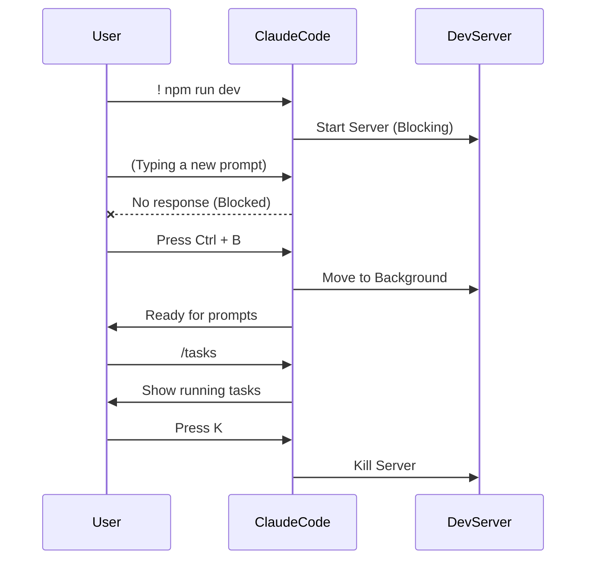

# 02 - Complex Tasks & Terminal Control

After mastering basic interactions, we will learn how to let Claude Code execute terminal commands, manage long-running background tasks, and explore more complex architectural refactoring.

## 1. Executing Terminal Commands (Bash)

Besides conversing with the model, you can directly execute Bash commands within the Claude Code interface.
- Type `!` to enter Bash mode. Start with an exclamation mark followed by the terminal command, for instance:
  `! open index.html`
- Although you can have the large language model write all the code for you, directly calling system commands is a highly efficient aspect of testing and previewing.

## 2. Refactoring Projects using Plan Mode

When we need to refactor a single HTML file project into a modern `React + TypeScript + Vite` architecture, letting the model modify things directly can get chaotic. This is where `Plan Mode` comes in handy:

1. Press `Shift + Tab` to toggle to **Plan Mode**.
2. Type your complete refactor prompt. If it involves multiple lines, press `Shift + Enter` to start a new line. Alternatively, press `Ctrl + G` to quickly edit long text prompts in a pop-up VSCode window.
   *Example: `Refactor the current ToDo application to use a React+TypeScript+Vite project structure. Retain all functionality, including the high, medium, and low priority markers.`*
3. Claude Code will output a detailed plan including the directory structure and a modification checklist. If you are unsatisfied, you can continue modifying it; if satisfied, you can choose to execute the plan and enter the Auto-Accept mode.

## 3. Disabling All Permission Checks (dangerously-skip-permissions)

Even in Auto mode, Claude Code will still ask your permission when executing **terminal commands** like `npm install`. If you want to delegate complete authority:
- Add a parameter when starting: `claude dangerously-skip-permissions`
- This will enter the **Bypass Permissions** mode. It will no longer ask whether it's installing dependencies, creating directories, or deleting files.
  _⚠️ Warning: This grants the AI the exact same system-level terminal execution permissions as you have. It is a double-edged sword offering high efficiency but high risk. Use with extreme caution!_

> **Image Suggestion (Nanobanana Prompt)**: A hyper-realistic, dramatic shot of a glowing red futuristic terminal screen displaying a massive hazard warning sign with the text "Bypass Permissions Mode Active" in bold, dripping digital font. The console interface is surrounded by complex holographic code streams floating in the air. The physical terminal has metallic edges, yellow caution tape detailing around the screen, set in a dark, atmospheric sci-fi server room with faint neon red and orange lighting. 8k resolution, cinematic composition.

## 4. Background Task Management

When you execute a command through Claude Code that blocks the terminal, such as a local server `npm run dev`, the model can no longer respond to your text inputs.
- **Suspend to Background**: Press `Ctrl + B` to push the currently running service to the background.
- **View Tasks**: Type the `/tasks` command to view the list of commands currently running in the background.
- **Terminate Task**: In the task list interface, select the target task and press the `K` key to kill the background service process.

---

## Knowledge Quiz

**Q1: How can you edit a long prompt in VSCode without exiting the Claude Code dialog box?**

Answer

Press `Ctrl + G`. This will pop up a VSCode tab. After editing, save and close it, and the content will be back-filled into Claude Code's input box.

**Q2: How do you place a terminal-blocking local development server into the background?**

Answer

Press `Ctrl + B` to send it to the background. Subsequently, you can use `/tasks` to view it and press `K` to close it.

