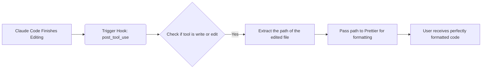

# 04 - Advanced Features & Customization

This chapter explores the most hardcore aspects of Claude Code as a productivity tool, ranging from event hijacking hooks to private knowledge loading and multi-agent collaborative systems.

## 1. Automated Formatting (Hooks)

The Hooks feature allows you to trigger custom scripts upon specific events (like before/after a tool is used). This enables magical functionalities like auto-formatting on save.
1. Use the `/hooks` command.
2. Select the trigger phase: `post_tool_use`.
3. Select the matcher: specify tool names like `write` or `edit`.
4. Mount the specific execution script, for example:
   A script to extract `file_path` from a json parameter and forward it to `prettier` for formatting.
   *(e.g., `jq -r .file_path | xargs prettier --write`)*

Following this, the resulting configurations can be stored in `settings.local.json` (exclusive to the local project), distributed with your Git repository, or saved in your global user configurations.

## 2. Dynamic Prompts (Agent Skills)

Are you tired of manually pasting prompts for files that require fixed formats (like daily development log summaries)?
**Think of an Agent Skill as a "user manual" or a dynamic Prompt template for Large Language Models inside your current context.**

- **Creation**: Create a `xxxx/skill.md` file in the system user directory (or a specified directory). It must contain top-level Yaml metadata like `name` and `description`, followed by the exact content format you demand.
- When Claude boots or confirms loading via `/skills`, the AI can auto-match your question to these Skills. Alternatively, you can actively invoke the skill by typing `/your-skill-name` appended to your request.
- **Key Trait**: Agent Skills *share* the primary session context. This means that all execution steps, logged items, and Token expenditures are compounded within your main chat window.

## 3. Sandboxed Work (SubAgents)

For tasks involving massive data scopes—such as "full repository Code Review"—running them directly in the main Agent will explode your context size, rendering the model sluggish and forgetful.

- **Create and Invoke SubAgent**: Type `/agent` -> `create new agent` -> select scope and name. You can, for instance, assign it *Read-Only* tool permissions and flag its output in a specific color (like Green).
- **Configure Prompt**: Specify in the SubAgent instructions: "Audit JavaScript and CSS according to..."
- **Run**: Prompt "Help me perform a code review." Claude will automatically dispatch the task to the green SubAgent.

## 4. Nuances: Skill vs. SubAgent 

| Feature | Agent Skill | SubAgent |
| :--- | :--- | :--- |
| **Context** | **Fully shares** the current primary dialogue context, increasing token load entirely | **Completely independent**, carving out a fresh thinking sandbox space |
| **Best Scenario** | Creating standardized articles, fulfilling quick, singular tasks (which require the main chat's context) | Massive bulk processing tasks, full repo code audits (to prevent intermediate reasoning from bloat) |
| **Return State** | Exposes step-by-step thinking calculations | Operates silently/separately in the background, only rendering the finalized investigative conclusion on your primary screen |

## 5. The All-in-One Capsule: Plugins 

A Plugin functions like an ultimate bundle, wrapping up everything we previously discussed (Agent Skills, Hooks, SubAgents, and MCP Server setups) into a single, distributable package.

- **Usage**: Type `/plugin` to open the Plugin Marketplace manager.
- You can discover numerous Frontend UI standardization plugins or Syntax Checking LSP plugins directly in the "Discover" tab.
- After installing a plugin like **Frontend Design**, simply instruct the AI to "Follow Frontend Design standards" before writing code. The LLM will automatically extract Anthropic's official UI design guidelines from the plugin's Agent Skills, handling color schemes, padding, and UI architectures. Instantly, your webpage will look professionally tailored.

> **Image Suggestion (Nanobanana Prompt)**: A macro shot of a shiny, glowing, metallic sci-fi "Plugin Cartridge" being smoothly slotted into the exposed, glowing back port of a sophisticated android robot. The cartridge has prominent futuristic text reading "PLUGIN INSTALLED". Surrounding the port are intricate, glowing holographic digital interfaces linking up in blue and orange energy. Cinematic lighting, photorealistic textures, cyberpunk aesthetic, 8k ultra detailed masterpiece.

---

## Knowledge Quiz

**Q1: Why is it highly recommended to use a SubAgent rather than configuring an Agent Skill for large-scale code review tasks?**

Answer

Because Agent Skills share the context flow and memory of the primary chat session. The extensive intermediate reasoning logs generated during massive code reviews will quickly bloat and pollute the main context, causing the model to become sluggish and expensive. A SubAgent operates in an entirely independent context sandbox, only reporting the final resulting conclusions back to the primary session.

**Q2: How can you use Claude Code to automatically beautify a messy single-line HTML file it just created?**

Answer

Use the `/hooks` command to mount a script action triggered during the `post_tool_use` event for the `write`/`edit` tools. You can chain this with a code formatter like Prettier to automatically reformat the output syntax.

