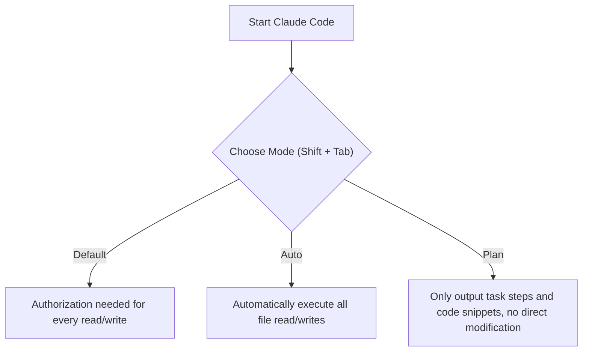

# 01 - Environment Setup & Basic Interaction (Environment Setup & Basic Interaction)

This chapter will guide you from scratch to set up the runtime environment for Claude Code and complete your first basic interaction. As a highly popular AI programming Agent, Claude Code can significantly boost your development efficiency.

## 1. Installing Claude Code

To install Claude Code, perform the following steps:
1. Visit the official Claude Code website and copy the installation command.
2. Paste and run the installation command in your terminal.
Example:
```bash
# Typical installation command (based on official prompts)
npm install -g @anthropic-ai/claude-code
```

> **Image Suggestion (Nanobanana Prompt)**: A sleek, minimalist dark-themed terminal application window on a desk. The terminal screen displays a clean green checkmark in the center, accompanied by glowing crisp white text reading "Claude Code Installed Successfully!". Below the text, there is a prominent progress bar filled to 100%. The surrounding environment is a dimly lit cyberpunk hacker room with subtle neon blue backlighting on the keyboard, ultra-detailed 8k resolution, cinematic lighting.

## 2. Login & Authorization

After installation, navigate to your project directory in the terminal, for example:
```bash
mkdir MyTodo
cd MyTodo
claude
```
Upon your first entry, it may prompt you to log in. If not prompted, you can manually trigger the login process by typing the `/login` command.
- **Login Methods**: The official platform offers two methods: Subscription (Pro/Max) and API Key (Pay-as-you-go).
- **Authorization**: After making a selection, you will be redirected to a browser page for authorization. Once successful, return to the terminal to complete the login.

## 3. The First Practical Task

Next, we will use Claude Code to create a simple ToDo application.
- Enter the command: `Make a ToDo app for me, implement it using HTML.`
- Claude Code will plan to create an `index.html` file and prompt you for permission/authorization.

## 4. Understanding the Three Modes (Default / Auto / Plan)

When Claude Code wants to perform file operations (like creating a file), you face a choice among three authorization modes. You can use the `Shift + Tab` shortcut to toggle between them:

1. **Default Mode ("Press ? for shortcuts")**: The most cautious mode. It asks for the user's explicit permission before every file creation or modification.
2. **Auto Mode ("Accept edits on")**: The most convenient mode. It automatically agrees to all file read/write operations during the current conversation, stopping repeated prompts.
3. **Plan Mode ("Plan mode on")**: Dedicated to discussing solutions and making plans without directly modifying project files. Ideal for brainstorming complex architectural changes.



---

## Knowledge Quiz

**Q1: What command should you use to manually trigger the login process in Claude Code?**
<details>
<summary>Answer</summary>
Type the `/login` command to trigger the login flow manually.
</details>

**Q2: If you want Claude Code to freely modify code during the current session without bothering you, which mode should you switch to? What shortcut key is used?**
<details>
<summary>Answer</summary>
Switch to Auto mode ("Accept edits on"). Use the `Shift + Tab` shortcut to toggle.
</details>
